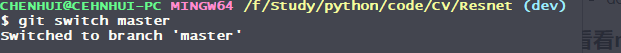

#  1 起步
## 1.1 获取帮助
-	
	$ git help < verb >          # 常用
	$ git < verb > --help        # 常用
	$ man git-< verb >
-
	另一种常用的
		$ git < verb > -h
		会输出简要的信息

# 2 Git基础
# 2.1 获取Git仓库
通常有两种获取 Git 项目仓库的方式：

-
	将尚未进行版本控制的本地目录转换为 Git 仓库；
-
	从其它服务器 克隆 一个已存在的 Git 仓库。

两种方式都会在你的本地机器上得到一个工作就绪的 Git 仓库。
***
在目录下创建Git仓库

-
	git init
	该命令将创建一个名为 .git 的子目录，这个子目录含有你初始化的 Git 仓库中所有的必须文件，这些文件是 Git 仓库的骨干。 但是，在这个时候，我们仅仅是做了一个初始化的操作，你的项目里的文件还没有被跟踪。

- 通过 git add 命令对指定文件进行追踪
	$ git add *.c
	$ git add LICENSE
	$ git commit -m 'initial project version'
	
	**注意git add 命令**。 这是个多功能命令：**可以用它开始跟踪新文件，或者把已跟踪的文件放到暂存区，还能用于合并时把有冲突的文件标记为已解决状态等**。 将这个命令理解为“精确地将内容添加到下一次提交中”而不是“将一个文件添加到项目中”要更加合适。
***
## 2.2 记录每次更新到仓库
***
你工作目录下的每一个文件都不外乎这两种状态：**已跟踪** 或 **未跟踪**。 **已跟踪的文件**是指那些被纳入了版本控制的文件，在上一次快照中有它们的记录，在工作一段时间后， 它们的**状态可能是未修改，已修改或已放入暂存区**。简而言之，已跟踪的文件就是 Git 已经知道的文件。

- 检查当前跟踪的文件状态
	git status
- 在项目下创建一个新的 README 文件。 如果之前并不存在这个文件，使用 git status 命令，你将看到一个新的未跟踪文件：
	- $ echo 'My Project' > README
$ git status
On branch master
Your branch is up-to-date with 'origin/master'.
Untracked files:
  (use "git add <file>..." to include in what will be committed)

    README # 没有被跟踪

nothing added to commit but untracked files present (use "git add" to track)
***
- 暂存已修改的文件
如果你修改了一个名为 CONTRIBUTING.md 的已被跟踪的文件，然后运行 git status 命令，会看到下面内容：
	- $ git status
On branch master
Your branch is up-to-date with 'origin/master'.
Changes to be committed:
  (use "git reset HEAD <file>..." to unstage)

		new file:   README # 已暂存，等待提交

	Changes not staged for commit:
	  (use "git add <file>..." to update what will be committed)
	  (use "git checkout -- <file>..." to discard changes in working directory)

		modified:   CONTRIBUTING.md # 修改但是没有暂存
**可以使用git add CONTRIBUTING.md 把修改后的文件暂存**

*如果这时又修改了CONTRIBUTING.md，你需要再次使用git add 把CONTRIBUTING.md暂存，否则直接commit的话，提交的是暂存区里边的CONTRIBUTING.md。*
***
如果commit注释写错了，只是想改一下注释，只需要：
git commit --amend

此时会进入默认vim编辑器，修改注释完毕后保存就好了。

***
git status 命令的输出十分详细，但其用语有些繁琐。 Git 有一个选项可以帮你缩短状态命令的输出，这样可以以简洁的方式查看更改。 如果你**使用 git status -s 命令或 git status --short 命令**，你将得到一种格式**更为紧凑的输出**。
 - $ git status -s
   M README
MM Rakefile
A   lib/git.rb
M  lib/simplegit.rb
?? LICENSE.txt
 - **新添加的未跟踪文件**前面有 **?? 标记**，**新添加到暂存区中的文件**前面有 **A 标记**，**修改过的文件**前面有 **M 标记**。 
- 
输出中有两栏，**左栏指明了暂存区的状态，右栏指明了工作区的状态**

- 例如，上面的状态报告显示： README 文件在工作区已修改但尚未暂存，而 lib/simplegit.rb 文件已修改且已暂存。 Rakefile 文件已修改，暂存后又作了修改，因此该文件的修改中既有已暂存的部分，又有未暂存的部分。
***

- 查看已暂存和未暂存的修改
你**想知道具体修改了什么地方，可以用 git diff 命令**。
它来回答这两个问题：**当前做的哪些更新尚未暂存？** **有哪些更新已暂存并准备好下次提交？** 
**注意**： git diff 只显示当前修改但是没有暂存的改动，如果想要查看**暂存 到 提交的之间的改动，需要使用 git diff --staged**
***
- 提交更新
	每次准备提交前，先用 git status 看下，你所需要的文件是不是都已暂存起来了， 然后再运行提交命令 git commit，可以在提交的界面中注释你的修改
	- 此外，也可以直接使用 git commit -m “你的注释”
	- 此外，如果嫌每次修改完以后使用git add 添加到暂存区，然后再提交麻烦的话 ，**git commit 加上 -a ，这个命令会自动把所有跟踪的文件暂存并提交。**

***
要**从 Git 中移除某个文件，就必须要从已跟踪文件清单中移除**（确切地说，是从**暂存区域移除**），然后提交。 可以用 **git rm 命令**完成此项工作，**并连带从工作目录中删除指定的文件**，这样以后就不会出现在未跟踪文件清单中了。

如果只是简单地从**工作目录中手工删除文件**，运行 git status 时**就会在 “Changes not staged for commit” 部分（也就是 未暂存清单**）看到：
		$ git status
		On branch master
		Your branch is up-to-date with 'origin/master'.
		Changes not staged for commit:
		  (use "git add/rm <file>..." to update what will be committed)
		  (use "git checkout -- <file>..." to discard changes in working directory)

				deleted:    PROJECTS.md

		no changes added to commit (use "git add" and/or "git commit -a")
- 这里分为3个块，工作区，暂存区，仓库
	- 工作区**可以使用rm 或 手动删除** ，然后**使用git add 或者 git rm 将删除**提交****
	- 如果**在工作目录删错了，可以使用restore返回**，如果**删除已经提交，那么可以用版本会退返回**.
	- 使用git log 显示提交版本，使用git reflog显示可以查看所有分支的所有操作记录（包括已经被删除的 commit 记录和 reset 的操作）
	- 例如执行 git reset --hard HEAD~1，退回到上一个版本，用git log则是看不出来被删除的commitid，用git reflog则可以看到被删除的commitid，我们就可以买后悔药，恢复到被删除的那个版本。
	- 也就是说假如我使用 git reset --hard HEAD^ (或者 版本id)回到了上一个版本（0）,那么怎么回来（版本1）？只需要找到版本（1）的commit id （用 git reflog 查看）。，再使用 git reset --hard id 即可
	- 关于git log 的参数可以查看[log 参数](https://git-scm.com/book/zh/v2/Git-%E5%9F%BA%E7%A1%80-%E6%9F%A5%E7%9C%8B%E6%8F%90%E4%BA%A4%E5%8E%86%E5%8F%B2)
**git commit --amend 命令能够实现在当前已经提交的基础上，增加提交一些东西，与直接commit不同的是，直接提交是产生了一个新版本，而**--amend**则是在原提交的基础上修改，或者说**用一个新的提交把原提交替换了**。从效果上来说，就像是**旧有的提交**从未存在过一样，**它并不会出现在仓库的历史**中。

***
- branch 分支
	- git branch 
		- 查看当前所有跟踪的分支
	- git branch dev
		- 创建一个dev分支
	- git switch dev
		- 定位选择到dev分支
- merge 合并
	首先切换到master分支上（git switch master）
	- git merge dev
		- 默认快速模式
		- 
	
	- git merge --no-ff -m "merge with no-ff" dev
		- 能够保留dev分支的操作历史，并且能够携带注释
		- 

***
stash 隐藏内容，具体实现效果看下边
- 首先在master分支：
	- 
- 切换到dev分支：
	- 
	- 
- 接下来在dev分支添加一个文件：dev.txt
	- 
	- 注意，此时并没有git add操作，更没有git commit dev.txt
- 现在切到master分支：
	- 
	- 但是！你会发现，master分支居然同步显示了dev分支中创建的 dev.txt文件：
		- 
		- 记住，此时dev分支中，没有add dev.txt，更没有commit
- 现在切换到dev.txt分支中，将dev.txt add ,然后再切换到master分支看看：
	- 
 	- 注意只是add了，还没有commit
- 切到master分支查看：
	-	
	- 
	- 仍然在master中显示

- 现在切换到dev.txt分支中，将dev.txt commit ：
	- 
- 然后再切换到master分支看看
	- 
	- 
	- 可以看到master中，dev.txt不见了。
-**猜想：可能是，当时dev和master合并，指针指向master和dev，是同一个位置，此时在本地workspace无论在那个分支做操作，其实都能在其他同一节点的分支上显现出来，因为指针指向同一个地方，只有dev这边commit以后，对于dev分支，指向这里的指针相比master是超前了一个commit的，在git时间线上，指针在master和dev上切换，这时指针指向就是不同的两个版本了。**
HEAD --->---v   ：HEAD 指向（切换） 分支master
&nbsp;&nbsp;&nbsp;&nbsp;------> master (dev) 
HEAD --->---^   ： HEAD 指向（切换） 分支dev
但是由于此时，**dev和master没有做commit**，**那么HEAD实际指向的都是同一个workspace**，只有dev做了commit之后，变成下边这样：
HEAD --->---|  ：HEAD 指向（切换） 分支master
$~~~~~~~~~~~~~~~~~$ V
---------> master$~~~~~~~$( 这时dev 超前一个commit )      
$~~~~~~~~~~~~~~~~~~$| （分离）  |
$~~~~~~~~~~~~~~~~~$------------>dev（commit以后）
$~~~~~~~~~~~~~$HEAD --->---^   ： HEAD 指向（切换） 分支dev
这时**切换到master之后，由于指向不同的节点，那么自然本地的workspace就和dev分支的不一样了。**

--- 
stash 命令
上边我们提到，当dev刚刚从master分出来的时候，实际上二者的指针指向一个地方，那么比如在dev添加修改了一些文件，(**但是还没有commit，可能没有调整完**)，现在突然又**发现master分支上有个bug**，现在**需要先branch一个bug分支去改bug**，但是，由于**那会dev分支上改的东西会在master分支上体现出来**，**这时从master上复制出来bug分支，就会把dev改的东西复制过来**，会影响后续的工作，那么我们**需要先把dev 的工作隐藏**起来（不是commit，只是藏起来），就可以用stash命令即可。
- 刚刚上一节，我们把dev.txt commit了，现在先撤销这个操作 git reset --soft HEAD~ ，退回到commit之前。
- 然后切换到master查看，可以看到dev.txt文件又显示出来了：
	-	
	- 
- 现在切回dev，然后调用git stash
	- 
	- dev分支：
		- 
		- dev.txt不见了
- 再看看master分支
	- 
	- 
	- 没有dev.txt。

***

****
